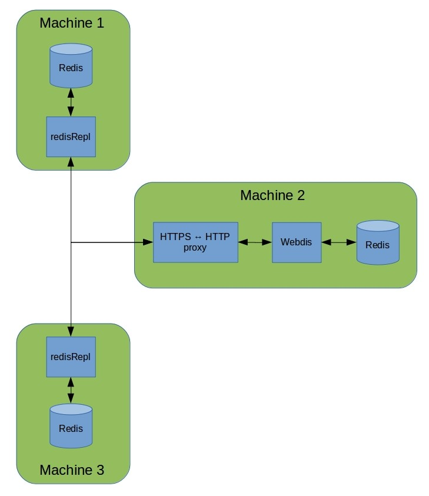

# README #

This is a small command line program to replicate remotely the commands sent to a local Redis instance. The remote instance is assumed to be running behind a HTTPS interface, conforming to the [Webdis](http://webd.is/) syntax. Since Webdis only supports plain HTTP, an HTTPS<->HTTP proxy must be running in front of it. The HTTPS connection must use bidirectional authentication, so that the appropriate certificate files must be provided via command line parameters. It is optionally possible to specify a namespace (i.e. a string prefix) in the remote instance to be replicated locally.  
**Plase note that this program is not intended to be a reliable replication mechanism, the state of the local and of the remote instance will diverge in case of loss of connection.**  

# How does it work? #

The architecture into which redisRepl can be inserted is shown in the following picture.

When started, redisRepl starts listening for events from a locally running Redis instance (in particular, string and hash events): every 'set' or 'hset' event is replicated remotely via HTTPS.  
If the '-rc' option is passed to redisRepl, then also the reverse is true: every 'set' or 'hset' event in the remote Redis instance is replicated locally. Of course, this kind of logic will result
in an infinite loop of local-remote replications, therefore it is necessary to avoid the replication of events which where generated by redisRepl itself. This is actually done via a simple mechanism
based on two maps: a map of 'locally expected events' and a map of 'remotely expected events'. Every time that redisRepl writes to the remote Redis instace, it already knows that it will receive an event associated to this action: therefore, it writes an entry in the 'remotely expected events' map which basically says 'ignore this remote event'. Similarly, the 'locally expected events' map allows to ignore events from the local Redis instance. Both maps are protected by mutexes for concurrent access.  
Events from the remote Redis instance are received via HTTP long polling, as implemented by Webdis (see the Webdis documentation for more info on this topic).

# License #

See the COPYING file.
